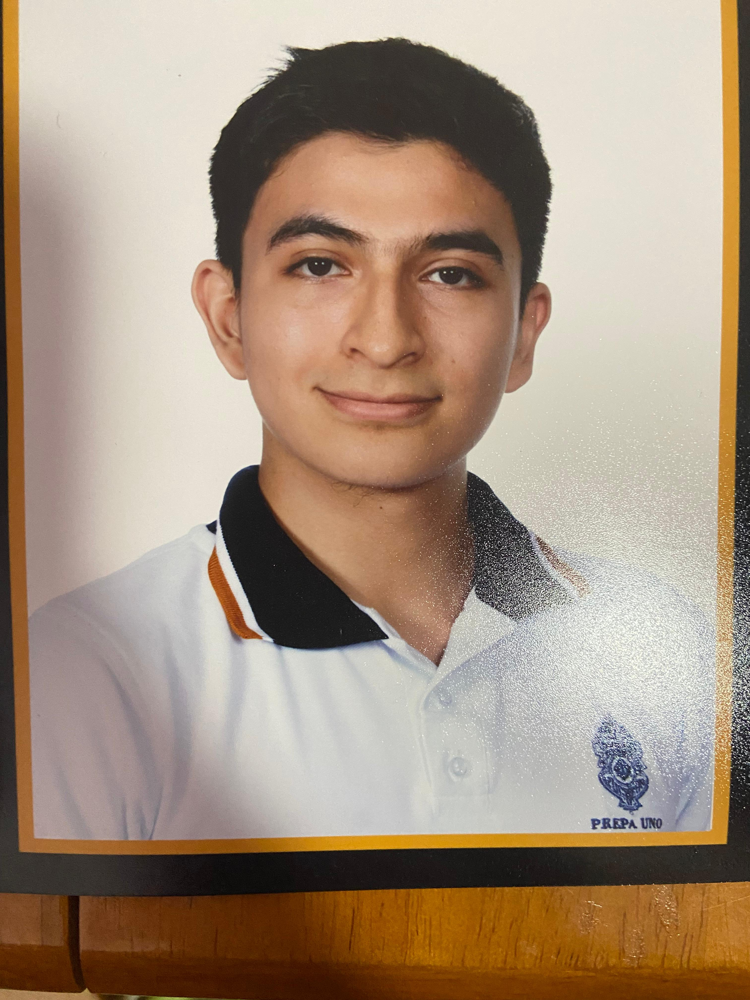

# Equipo de Arquitectura de software

En este repositorio se lleva un registro de las actividades necesarias para el desarrollo de los proyectos para la materia Arquitectura de software. Les compartimos la información relacionada:

###  "Facultad de Matemáticas"
#### ARQUITECTURA DE SOFTWARE

## 👨‍🏫 Maestro encargado
 - Vitor Hugo Menéndez Domínguez

# 👥 Integrantes del equipo

---

### Cuevas García Braulio Samuel

**Presentación:**  
Escribe aquí una breve descripción o presentación personal.  
Por ejemplo: *"Soy estudiante de ... me interesa ... y mi rol en el proyecto es ..."*  

---

### Dzay Villanueva Mauricio

**Presentación:**  
Escribe aquí una breve descripción o presentación personal.  

---

### Moo Pan Jareth Jaziel

**Presentación:**  
Escribe aquí una breve descripción o presentación personal.  

---

---
## Documentación:
